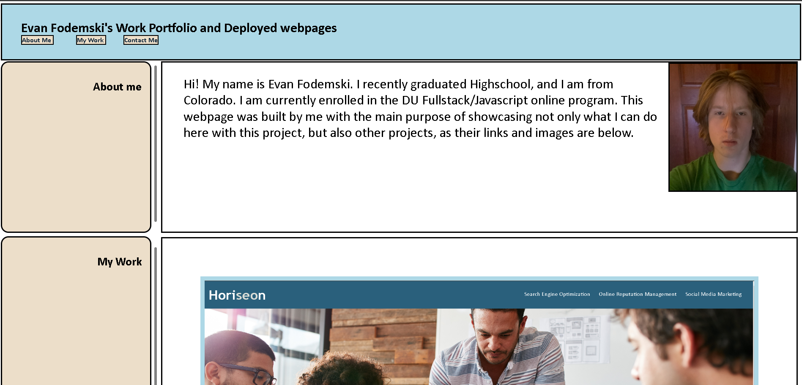

# Project2
Evan Fodemski second bootcamp project

# Description
In this project I created a Deployed webpage from Scrath with no starter code. I built all the HTML and the CSS completely myself. The use of this project was too have a deployed webpage that I made that can showcase my other projects. 

## Screenshot

## Link to Deployed Webpage
https://evanfodemski.github.io/Project2/

### Code is located in Index.HTMl as well as Style.CSS within the Assets folder in my Repo